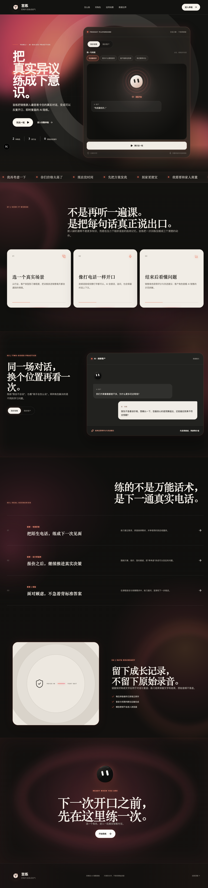

# Yanlian · AI Sales Practice Coach

言练是一款面向销售新人的双角色 AI 陪练：你可以扮演销售，与 AI 客户进行真实异议对话并获得评分；也可以扮演客户，观察 AI 销售如何推进需求、处理顾虑并完成复盘。

> This repository contains a locally runnable MVP. It does not include hosted model credentials or a public cloud demo.



## Features

- 双角色训练：用户扮销售 / 用户扮客户
- 连续实时语音：实时转写、静音断句、AI 播报后自动恢复收听
- 文字陪练：语音不可用时可直接输入
- 训练结果：销售角色获得评分与建议，客户角色获得示范拆解
- 话术助手：围绕真实销售问题提供建议
- 历史记录：保存文字消息、训练结果和趋势，原始录音不落盘
- 装修、教育、保险场景；装修支持电销获客与设计师签约两条线
- 可选邀请码登录与后端数据隔离，供公网演示部署使用

## Tech stack

- Frontend: Next.js 16, React 19, TypeScript
- Backend: FastAPI, SQLAlchemy, SQLite
- LLM: OpenAI-compatible API
- Speech: Alibaba Cloud ASR and TTS; optional Doubao TTS adapter

## Requirements

- Python 3.12
- Node.js 22+
- An OpenAI-compatible model endpoint and API key
- Alibaba Cloud Intelligent Speech credentials for voice features

The external model and speech services may incur charges. Never commit real credentials.

## Quick start

### macOS / Linux

```bash
git clone https://github.com/siguadht/yanlian-ai-sales-coach.git
cd yanlian-ai-sales-coach
./scripts/setup.sh
```

Edit `.env` and replace every placeholder with your own service configuration, then run:

```bash
./scripts/dev.sh
```

### Windows PowerShell

```powershell
git clone https://github.com/siguadht/yanlian-ai-sales-coach.git
cd yanlian-ai-sales-coach
Set-ExecutionPolicy -Scope Process Bypass
.\scripts\setup.ps1
```

Edit `.env`, then run:

```powershell
.\scripts\dev.ps1
```

Open:

- Product workspace: <http://127.0.0.1:3000/>
- Promotional page: <http://127.0.0.1:3000/landing>
- Backend API docs: <http://127.0.0.1:18011/docs>

## Configuration

Copying `.env.example` to `.env` is handled by the setup scripts. Required values:

```dotenv
LLM_BASE_URL=
LLM_API_KEY=
LLM_DIALOG_MODEL=
LLM_EVAL_MODEL=
ALIYUN_ACCESS_KEY_ID=
ALIYUN_ACCESS_KEY_SECRET=
ALIYUN_ASR_APP_KEY=
ALIYUN_TTS_APP_KEY=
```

For a public demo, deploy behind HTTPS and configure `PUBLIC_AUTH_ENABLED=true`, a random `AUTH_SECRET`, separate `INVITE_CODES`, a persistent `DATABASE_URL`, and a public `wss://` origin. Do not expose the local SQLite database or reuse invitation codes across users.

## Manual development

Backend:

```bash
cd backend
python3.12 -m venv .venv
.venv/bin/pip install -r requirements.txt
.venv/bin/python -m uvicorn app.main:app --host 127.0.0.1 --port 18011
```

Frontend, in another terminal:

```bash
cd frontend
npm ci
BACKEND_URL=http://127.0.0.1:18011 \
NEXT_PUBLIC_BACKEND_WS_ORIGIN=ws://127.0.0.1:18011 \
npm run dev -- --hostname 127.0.0.1 --port 3000
```

## Verification

```bash
cd backend && .venv/bin/python -m pytest -q
cd ../frontend && npm run test && npm run lint && npm run typecheck && npm run build
```

Browser microphone access requires `localhost`, `127.0.0.1`, or HTTPS. The current continuous-call mode pauses listening while the AI is speaking and does not support interruption.

## Data and security

- `.env`, local databases, invitation codes, build artifacts, caches, and raw audio are excluded from Git.
- Raw audio is processed in memory and is not persisted by the application.
- Model and speech credentials stay on the backend.
- Public deployments must enable authentication, HTTPS, persistent storage, rate limits, and per-user isolation.

## License

[MIT](LICENSE)
